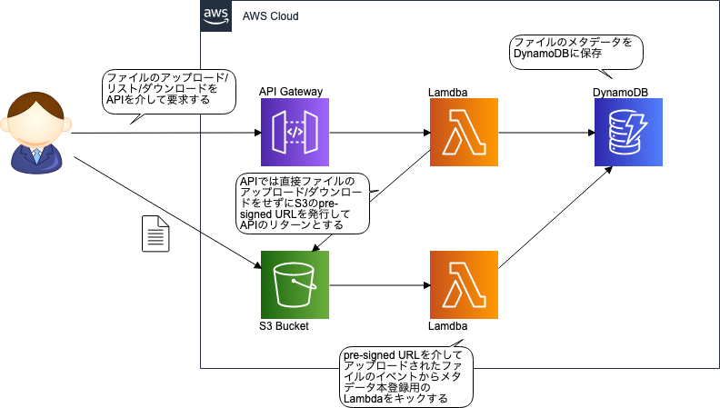

# Pycon Serverless Tutorial



## 概要
上記画像のアプリケーションを書いた。

命名等は特に何も考えずに作成しているので色々と意見がほしい。

簡単な型ヒントとflake8によるLintまでは行っている。

なお、単体テストはこれから書くところなので、動かない。

### 実装したもの

以下の4つを実装した

- [API, POST] metadataを作成し、アップロード用のPreSignedUrlを返すエンドポイント
- [Event] S3に画像がアップロードされると、size, width, heightをmetadataに書き込むLambda
- [API, GET] metadataの情報を返すエンドポイント。idを指定しない全件取得と、idを指定する単件取得の両方を実装。
- [API, PUT] metadataの更新を行うエンドポイント。再アップロード用のPreSignUrlを発行する。

## 使い方

### 環境構築
Python3系の環境で動かしてください。

```bash
$ pip install pipenv # インストール済みであれば必要ない
$ pipenv install
```

### デプロイ

基本的にsam-cliを使用してデプロイを行っている。

```bash
$ AWS_PROFILE=xxx-profile \
  SAM_ARTIFACT_BUCKET=xxx-bucket \
  make deploy
```

上記コマンドでデプロイ可能。

API GatewayのURLは`make deploy`の最後に出力される。

(例)
```json
[
    {
        "OutputKey": "ApiBaseUrl",
        "OutputValue": "https://dmmh07aela.execute-api.ap-northeast-1.amazonaws.com/v1"
    },
    {
        "OutputKey": "ApiMetadataeUrl",
        "OutputValue": "https://dmmh07aela.execute-api.ap-northeast-1.amazonaws.com/v1/metadata"
    }
]
```

### Lint

flake8を使用したLintとmypyによる型ヒントの静的解析を行っている。

```bash
$ make lint
```

## APIについて

### [POST] `/metadata`

metadataの作成用エンドポイント。  
`Content-Type: application/json`のみ受け付ける。

#### Request Body
```json
{
  "filename": "{ファイル名}"
}
```

- filename: [string, required, regex: [^a-zA-Z0-9_\-.]] アップロードするファイルの名前

#### Response Body
例)
```json
{
  "metadata": {
    "id": "66617749-4262-4979-8481-1ac58378e33d",
    "createdAt": 1565659449835,
    "filename": "aaa.png",
    "isUploaded": false
  },
  "preSignedUrl": {
    "id": "66617749-4262-4979-8481-1ac58378e33d",
    "url": "....",
    "method": "PUT",
    "expiresIn": 3600
  }
}
```

- metadata: [dict] DynamoDBに格納したmetadata
  - id: [string, required, uuid] metadataのID。UUIDを使用する。
  - createdAt: [int, required] metadataの作成日時。ミリ秒単位のUNIXTIME。
  - filename: [string, required] ファイル名
  - isUploaded: [boolean, required] アップロード済みかを示す。
- preSignedUrl: [dict] アップロード用のPreSignedUrlの情報を記載している
  - id: [string, required, uuid] metadataのID。
  - url: [string, required] PreSignedUrl
  - method: [string, required] HTTPのメソッド
  - expiresIn: [int, required] PreSignedUrlの有効期限。秒単位。
  
### [GET] `/metadata`
metadataの全件取得用エンドポイント

#### ResponseBody
例)
```json
{
  "metadata": [
    {
      "filename": "test.png",
      "size": 56212,
      "height": 500,
      "updatedAt": 1565629317026,
      "width": 500,
      "createdAt": 1565626431163,
      "id": "e6bbfdce-5e2d-4088-a516-b088088aa95c",
      "isUploaded": true
    },
    {
      "filename": "aaa.png",
      "createdAt": 1565659449835,
      "id": "66617749-4262-4979-8481-1ac58378e33d",
      "isUploaded": false
    }
  ],
  "preSignedUrls": [
    {
      "id": "e6bbfdce-5e2d-4088-a516-b088088aa95c",
      "url": "......",
      "method": "GET",
      "expiresIn": 3600
    }
  ]
}
```

- metadata: [list[dict]] metadataの一覧。
  - filename: [str, required] ファイル名
  - size: [int] ファイルの容量。byte単位。
  - height: [int] 画像の縦幅。pixel単位
  - updatedAt: [int] metadataの更新日時。ミリ秒単位のUNIXTIME
  - width: [int] 画像の横幅。pixel単位
  - createdAt: [int, required] metadataの作成日時。ミリ秒単位のUNIXTIME
  - id: [string, required, uuid] metadataのID。UUIDを使用。
  - isUploaded: [boolean, required] 画像がアップロードされているかを判断
- preSignedUrls: [list[dict]] PreSignedUrlの一覧
  - id: [string, required, uuid] metadataのID。
  - url: [string, required] PreSignedUrl
  - method: [string, required] HTTPのメソッド
  - expiresIn: [int, required] PreSignedUrlの有効期限。秒単位。

`isUploaded == true`となっているmetadataはPreSignedUrlを発行している。  
(そうでない場合は、PreSignedUrlで取得すべきデータが存在しないから発行していない)

### [GET] `/metadata/{id}`
metadataの単件取得用エンドポイント

#### Response Body
例)
```json
{
  "metadata": {
    "filename": "test.png",
    "size": 56212,
    "height": 500,
    "updatedAt": 1565629317026,
    "width": 500,
    "createdAt": 1565626431163,
    "id": "e6bbfdce-5e2d-4088-a516-b088088aa95c",
    "isUploaded": true
  },
  "preSignedUrl": {
    "id": "e6bbfdce-5e2d-4088-a516-b088088aa95c",
    "url": "......",
    "method": "GET",
    "expiresIn": 3600
  }
}
```

- metadata: [dict] metadata
  - filename: [str, required] ファイル名
  - size: [int] ファイルの容量。byte単位。
  - height: [int] 画像の縦幅。pixel単位
  - updatedAt: [int] metadataの更新日時。ミリ秒単位のUNIXTIME
  - width: [int] 画像の横幅。pixel単位
  - createdAt: [int, required] metadataの作成日時。ミリ秒単位のUNIXTIME
  - id: [string, required, uuid] metadataのID。UUIDを使用。
  - isUploaded: [boolean, required] 画像がアップロードされているかを判断
- preSignedUrls: [dict or null] PreSignedUrl。`isUploaded == false`のときnullが入る。
  - id: [string, required, uuid] metadataのID。
  - url: [string, required] PreSignedUrl
  - method: [string, required] HTTPのメソッド
  - expiresIn: [int, required] PreSignedUrlの有効期限。秒単位。


### [PUT] `/metadata/{id}`
metadataの更新用エンドポイント

#### Request Body
例)
```json
{
  "filename": "{新しいファイル名}"
}
```

- filename: [string] 新しいファイル名

filenameは必須要素ではない。  
ファイル名を変更せずに画像だけ差し替えることを想定しているため。
そのため、RequestBodyそのものが必須ではない。

#### Response Body
例)
```json
{
  "metadata": {
    "filename": "test.png",
    "size": 56212,
    "height": 500,
    "updatedAt": 1565629317026,
    "width": 500,
    "createdAt": 1565626431163,
    "id": "e6bbfdce-5e2d-4088-a516-b088088aa95c",
    "isUploaded": true
  },
  "preSignedUrl": {
    "id": "e6bbfdce-5e2d-4088-a516-b088088aa95c",
    "url": "......",
    "method": "PUT",
    "expiresIn": 3600
  }
}
```

- metadata: [dict] metadata
  - filename: [str, required] ファイル名
  - size: [int] ファイルの容量。byte単位。
  - height: [int] 画像の縦幅。pixel単位
  - updatedAt: [int] metadataの更新日時。ミリ秒単位のUNIXTIME
  - width: [int] 画像の横幅。pixel単位
  - createdAt: [int, required] metadataの作成日時。ミリ秒単位のUNIXTIME
  - id: [string, required, uuid] metadataのID。UUIDを使用。
  - isUploaded: [boolean, required] 画像がアップロードされているかを判断
- preSignedUrls: [dict or null] PreSignedUrl。
  - id: [string, required, uuid] metadataのID。
  - url: [string, required] PreSignedUrl
  - method: [string, required] HTTPのメソッド
  - expiresIn: [int, required] PreSignedUrlの有効期限。秒単位。
